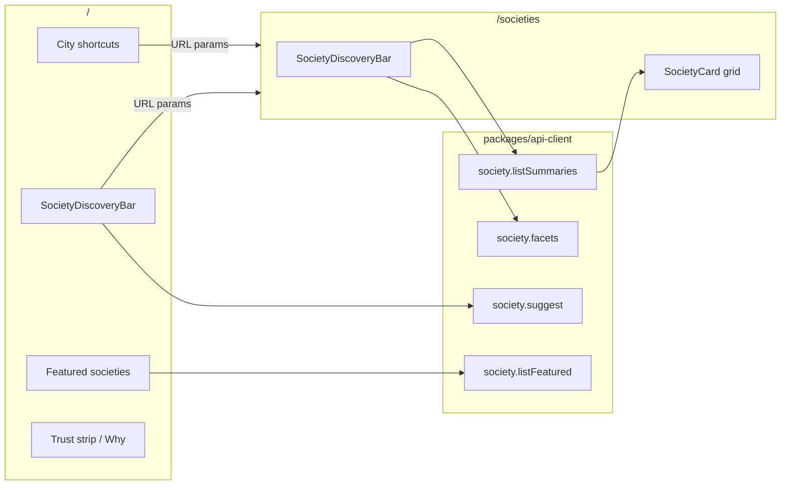

# Homepage & Discovery V2 — Foundations

Shared, cross-cutting rules for **every** homepage/discovery module. Attach this in (almost) every build session alongside the specific module file.

- Index: [`../homepage-v2-spec.md`](../homepage-v2-spec.md)
- Build prompts: [`../../homepage-v2-playbook.md`](../../homepage-v2-playbook.md)
- Related: [ADR-007](../ADR-007-concierge-pivot.md), [ADR-010](../ADR-010-search-first-homepage.md), [Society Profile V2 foundations](../society-profile-v2/foundations.md)

---

## 1. Expert thesis

### 1.1 What world-class marketplaces get right

A panel synthesis across Airbnb / Booking (travel discovery), Zillow / Redfin (property search), Property Finder / Bayut / Zameen (MENA & Pakistan real estate):

1. **Search is the product.** The first viewport answers "where / what / budget" without scrolling. Marketing copy serves the search bar; it does not replace it.
2. **Progressive disclosure.** On the **homepage**, only Search + City stay inline so the first viewport stays one job; budget/type and secondary facets live behind "Filters". On the **directory**, full Tier A stays visible (results-page density is correct).
3. **URL is the source of truth.** Every filter combination is shareable, bookmarkable, and (where useful) crawlable. Client-only filter state is a bug for a marketplace.
4. **Results are a continuation, not a reboot.** Home search lands on the same directory that advanced filters use — one mental model.
5. **Trust sits next to discovery, not above it.** Badges and proof reinforce search; they do not force a full "about us" read before the buyer can act.
6. **Empty and zero-result states are designed.** "No societies match…" + widen filters is as important as the happy path.
7. **Mobile is the primary canvas.** Stacked discovery bar, bottom-sheet Tier B filters, 44px targets — not a desktop bar squeezed down.

### 1.2 What Sectoria must *not* copy from Zameen/listing spam

- Endless listing grids with dealer phone numbers on the home page.
- Manipulative scarcity ("Only 3 plots left!").
- SEO doorway pages that are thin city spam without verified data.
- Self-serve "Buy now" that bypasses verification and concierge pricing.

Sectoria's differentiator is **verified society data + concierge negotiation**. Discovery must get buyers to the *right society profiles* faster — then the existing quote path converts trust into a lead.

### 1.3 Jobs-to-be-done (homepage)

| Priority | Job | Success signal |
|---|---|---|
| P0 | "Find societies in my city that match budget / plot type" | Submit search → `/societies` with params → relevant cards |
| P0 | "Find a named society I already know" | Typeahead or search → profile or filtered list |
| P1 | "Understand why Sectoria is safer" | Compact trust strip + deeper "Why" section *below* discovery |
| P1 | "See proof there is real inventory" | Featured / HSMS-linked / city hubs with real cards |
| P2 | "Start comparing" | Soft CTA to `/compare` after 2+ candidates |

---

## 2. Concierge & security alignment

Applies across all modules (`.cursor/rules/concierge-model.mdc`, `.cursor/rules/security.mdc`):

- **CTAs from discovery:** Society card → society profile; secondary → Compare; conversion → `MARKETPLACE_ROUTES.support` / quote form. Never "Book now".
- **No dealer net/contact** in search results, typeahead, or homepage modules.
- **Public reads only:** `publishStatus = PUBLISHED` (already enforced by `listSummaries` / `facets`).
- **Public verification filter UI:** offer **`VERIFIED` and `HSMS_LINKED` only**. `PENDING` remains valid in the API for admin/ops surfaces; exposing it on the marketplace undermines trust.
- **Rate-limit** `society.suggest` with existing `rateLimit({ scope: "society:suggest", by: "ip" })` from `packages/api-client/src/middleware/rate-limit.ts`.
- **No PII** in logs or future analytics payloads (society slug/id and filter keys/enums only). V2 does **not** ship an analytics stub.

---

## 3. Architecture overview

### 3.1 Layering rules

- **Types first** (`packages/types`): extend `societyListSummariesInputSchema` for new filters; curated `DEVELOPMENT_STAGES` + `COMMON_PLOT_SIZE_LABELS`; URL parse helpers stay thin and share the same param names.
- **API** (`packages/api-client`): all new filter dimensions live on `listSummaries` / `facets`; stay **bounded-query** (no per-society fan-out). Price filter/sort uses denormalized `Society.startingPricePkr`. Plot/size filters use a single `categories: { some: { … } }` predicate.
- **UI** (`apps/web/components/marketplace/`): one shared `SocietyDiscoveryBar` for home (hero) and directory (toolbar). Page shells stay Server Components; the bar is the client leaf.
- **URL contract:** same param names on home submit and `/societies`. Keep `search` (already in schema) — never invent a parallel `q`.

### 3.2 URL param contract (canonical)

| Param | Meaning | Example |
|---|---|---|
| `search` | Free-text name/city | `bahria` |
| `citySlug` | City filter | `lahore` |
| `authority` | Development authority code | `LDA` |
| `verificationTier` | `VERIFIED` \| `HSMS_LINKED` (public UI); API may still accept `PENDING` | `HSMS_LINKED` |
| `plotType` | `RESIDENTIAL` \| `COMMERCIAL` | `RESIDENTIAL` |
| `sizeLabel` | Exact size label match on category | `5 Marla` |
| `priceMinPkr` / `priceMaxPkr` | Starting-price band (PKR integers) | `5000000` |
| `developmentStage` | Society development stage | `Possession Underway` |
| `bookingStatus` | `OPEN` \| `UPCOMING` \| `CLOSED` | `OPEN` |
| `sort` | `name` \| `priceAsc` \| `priceDesc` | `priceAsc` |

All params optional. Invalid values are **ignored** (never 500 on SSR). If both price bounds are set and `priceMinPkr > priceMaxPkr`, the URL parser **drops the pair**; the API rejects the same with `BAD_REQUEST` when called directly.

**V2 does not include `ratingDesc`.** Rating sort needs a maintained aggregate; defer to V2.1.

### 3.3 Category + price filter semantics (locked)

- **Plot type ∩ size:** a society matches when **at least one** `InventoryCategory` satisfies **all** category-level predicates together (`plotType` and `sizeLabel` ANDed inside one `categories.some`).
- **Price band:** filter on denormalized `Society.startingPricePkr` (`gte` / `lte`), **not** a second category price predicate. Null `startingPricePkr` societies are excluded when a price bound is active; for sort, nulls sort last.

### 3.4 Search index limitation (locked)

M0 added a `pg_trgm` GIN index on `Society.name` only. `listSummaries` `search` also matches `city` via `contains` (case-insensitive) **without** a city trigram. V2 does **not** add a city trigram — smallest correct diff. Document in code comments next to the `search` where-clause.

---

## 4. Filter taxonomy (intent → facet)

### Tier A — by surface (locked)

| Surface | Inline (always visible) | Behind "Filters" |
|---|---|---|
| `mode=home` | **Search + City** + Search CTA | Budget, plot type, **and** all Tier B |
| `mode=directory` | Search, City, Budget, Plot type | Tier B only |

Tier A field set (when shown):

1. **Search** (free text)
2. **City** (`citySlug`)
3. **Budget** (`priceMinPkr` / `priceMaxPkr`) — preset bands in UI; raw ints in URL
4. **Plot type** (`plotType`)

### Tier B — "More filters" sheet

5. Verification tier (`VERIFIED` / `HSMS_LINKED` only in public UI)
6. Authority
7. Size (`sizeLabel` — curated `COMMON_PLOT_SIZE_LABELS` in the UI; facets may list live labels)
8. Development stage (curated `DEVELOPMENT_STAGES` in the UI)
9. Booking status
10. Sort (`name` / `priceAsc` / `priceDesc`)

### Tier C — deferred (V2.1+)

- Distance-from-pin / map viewport
- Amenity multi-select
- Developer filter
- Installment-vs-lump-sum payment plan shape
- `ratingDesc` sort / maintained `avgRating`
- Directory "Load more" / cursor pagination UI (API already cursor-paginated; page shows first 48 only)
- Sticky compact search on scroll
- Ops `featuredRank` curation column

---

## 5. Homepage section order (must follow)

First viewport (mobile and desktop):

1. Brand / product name signal (existing header; hero headline remains Sectoria-owned)
2. **One** compact trust line (reuse "Verified before it's listed" + shield — not optional, not a pill wall)
3. One headline + one supporting sentence
4. **SocietyDiscoveryBar** (`mode=home`: Search + City inline + Search CTA only)
5. City shortcut chips: `{ slug, label, count }`, `count > 0`, **max 6**, order by count desc; mobile horizontal scroll; count as muted secondary text

**Hero CTA hierarchy:** sole filled primary = DiscoveryBar Search (`size="lg"`). No "Explore societies" primary. Get best price belongs in the next-step band (ghost/text in hero is allowed at most once, preferred omitted).

Below the fold:

6. Compact trust strip (4 short signals — not the full bento yet)
7. Featured / verified societies via `listFeatured` (HSMS → VERIFIED → price → name — **not** alphabetical or cheapest-first)
8. Fuller "Why Sectoria" bento (existing content, demoted)
9. Soft compare / get-best-price CTA band

**Hard rule:** Do not place stats strips, blog teasers, dealer promos, or schedule callouts in the first viewport.

---

## 6. Design system constraints

- Tokens only (`ui-design-system-sectoria.mdc`). No new fonts; Inter + JetBrains Mono.
- Discovery bar: card surface, `border-border-base`, `rounded-xl` / `rounded-2xl`, `shadow-sm` (focus → `shadow-md`) — **not** a floating glassmorphism pill cluster. Home search field min height 44–48px so it reads as the product.
- Preset budget chips: subtle selected state (`bg-surface-subtle` + navy border) — not rainbow pills.
- Five states for results and typeahead: loading skeleton, empty, error, partial (facets failed but list ok), success.
- Motion: functional only (pending filter transition via `aria-busy`); respect `prefers-reduced-motion`.

---

## 7. Performance & scale

- **Price:** denormalize `Society.startingPricePkr Int?` in H1, backfill from categories, maintain via `recomputeSocietyStartingPrice` on inventory category create/update/delete. Index with `@@index([publishStatus, startingPricePkr])` (composite preferred for PUBLISHED directory queries). Do **not** filter price by loading all categories into memory.
- Homepage stays ISR-friendly (`revalidate = 3600`). Discovery bar is a client island; H1/copy/featured stay server-rendered so LCP is not the interactive bar.
- Submitting search navigates to `/societies` (dynamic) — do not force `/` to `force-dynamic` solely for filters.
- Typeahead: debounce ≥ 200ms; min 2 characters; max 5 societies + 3 cities; `rateLimit` by IP.
- Directory first page remains capped (today 48). **Cursor "Load more" UI is V2.1** — document the cap; do not pretend infinite scroll ships in V2.
- CWV target: Lighthouse Performance ≥ 90 on `/` after H3; no layout shift from unsized hero media on cards (existing `SocietyCard` / `next/image` rules).

---

## 8. Rollout & phasing

0. **H0** — `society-discovery-params` + directory free-text search (no homepage hero yet).
1. **H1** — `startingPricePkr`, rich `listSummaries` / `facets`, curated stage/size constants.
2. **H2** — Shared `SocietyDiscoveryBar` on `/societies` (full directory Tier A).
3. **H3** — Homepage IA + slim DiscoveryBar on `/` + `listFeatured` ranking (first-look ship).
4. **H4** — `society.suggest` typeahead (in-scope, rate-limited).
5. **H5** — SEO SearchAction + city-chip a11y polish (ranking already shipped in H3).
6. **H6** — Playwright discovery path.

**First visible ship:** H0→H3. **Hardening wave:** H4→H6.

---

## 9. Acceptance (feature-complete definition)

- Homepage first viewport is search-led: trust line + headline + one sentence + Search/City bar + ≤6 city chips — no budget/type inline, no dual primary CTAs.
- Submitting the bar lands on `/societies` with canonical URL params and matching results.
- Directory exposes full Tier A + Tier B (including free-text search).
- Invalid params ignored; empty state specific; public verification UI excludes `PENDING`.
- Featured uses `listFeatured` trust-first ranking (H3); copy never says "ordered alphabetically" or implies cheapest-first.
- `startingPricePkr` denormalized, composite-indexed, backfilled, recomputed on inventory writes.
- All public reads remain PUBLISHED-only; no dealer/net exposure; no Book Now.
- `society.suggest` rate-limited by IP; params helpers unit-tested.
- `pnpm turbo run test lint typecheck` clean; Core Web Vitals target met on `/`.
