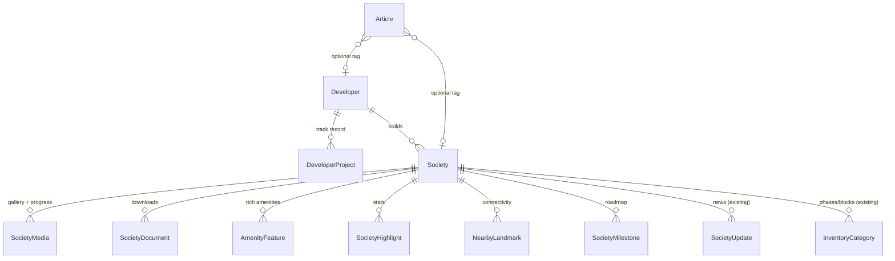

# Society Profile V2 — Technical Specification

**Status:** Proposed
**Date:** 2026-06-30
**Owner:** Marketplace / Society experience
**Related:** [ADR-007 (concierge pivot)](ADR-007-concierge-pivot.md), [ADR-008 (society profile maps)](ADR-008-society-profile-maps.md), proposed **ADR-009 (media & document storage)** summarized in §7
**Build prompts:** [`docs/society-profile-v2-playbook.md`](../society-profile-v2-playbook.md)

---

## 1. Context & goals

Sectoria's public society profile (`apps/web/app/(marketplace)/societies/[city]/[society]/page.tsx`) is information-rich on **trust and compliance** (verification tier, LOP/NOC references, payment-plan matrix, booking status, map + land area, updates timeline, reviews) but thin on the **visual, narrative, and credibility** content that buyers expect from a modern housing-society site.

The benchmark for this spec is **Urban City Lahore** (`urbancitylahore.com`), a developer-grade site. The features below close the gap between what Sectoria *models* and what it *shows*, while staying strictly inside the concierge product model.

### 1.1 Urban City benchmark — what they surface that we do not

| Urban City feature | Sectoria today |
|---|---|
| Cinematic hero + photo galleries | `heroImageUrl` modeled but **not rendered**; no gallery model |
| Dated development-progress photo galleries ("Progress You Can See") | Text-only `SocietyUpdate` timeline |
| Downloadable master-plan / brochure / payment-plan PDFs ("View PDF") | Not modeled |
| Rich amenity cards (image + title + description) | Plain `amenities String[]` pills |
| Nearby landmarks with drive-times + key routes | Map pin + opt-in distance only |
| Developer/builder profile + past-project track record | No developer entity at all |
| Structured milestone roadmap with dates | `SocietyUpdate` only (unstructured news) |
| Sub-community / phase destinations | `phase`/`block` strings on categories |
| Stats / achievement highlights | `developmentStage` + `developmentPct` only |
| Authorized sales partners | `SocietyPartnerAuthorization` exists but hidden |
| Blog / SEO content hub | None |
| Virtual tour / video | None |

### 1.2 Goals

1. Give buyers **maximum decision-useful information** on a society profile: visuals, documents, amenities, location context, developer credibility, milestones, and live progress.
2. Deliver it with **best-in-class UI/UX** consistent with the Sectoria design system (bento layout, five-states discipline, trust patterns, PKR/CNIC formatting).
3. Keep every change **additive and backward-compatible** at the data layer.

### 1.3 Non-goals (hard constraints)

- **No self-serve "Book Now".** Every CTA funnels to the concierge flow: compare → request quote → advisor. (`.cursor/rules/concierge-model.mdc`)
- **No dealer exposure.** Authorized sales partners may be displayed only as a *trust signal*, gated behind a feature flag, and must never expose `dealerNetPkr`, `spreadPkr`, dealer phone/email, or any buyer↔dealer contact path.
- **No paid map/Places API.** Maps stay Leaflet/OSM per ADR-008; nearby landmarks are admin-entered, not fetched from Google Places.
- **No new plaintext PII columns** anywhere (`.cursor/rules/database.mdc`).

---

## 2. Architecture overview

All new content hangs off `Society` (and a new top-level `Developer`). The composition root remains `packages/api-client`; pages never touch Prisma/domain directly.



### 2.1 Layering rules applied to every module

- **Types first** (`packages/types`): Zod schema + `as const` enums; TS types via `z.infer`. Mirror Prisma enums exactly (`.cursor/rules/oop-and-domain-modeling.mdc`).
- **Schema** (`packages/database`): `cuid()` ids, `@@index` on every FK, `Decimal` for money, enums for closed sets. One migration per logical change.
- **API** (`packages/api-client`): one router file per area; `publicProcedure` for reads consumed by the profile; `societyAdminProcedure` + `assertSocietyOwnership` for portal writes; `superAdminProcedure` for `Developer`/`Article` (platform-curated). DTO mappers serialize `Date`/`Decimal` like `society-update.router.ts`.
- **UI** (`apps/web`): server components fetch via `getApi()`; client-only widgets (lightbox, video) dynamically imported with skeleton fallbacks to preserve ISR/SEO, mirroring `society-location-map-dynamic.tsx`.

---

## 3. Module specs (M1–M8)

Each module lists: data model, types, API, UI placement, five-states/SEO, and acceptance criteria.

### M1 — Visual media, galleries & virtual tour

**Problem:** `heroImageUrl` is intentionally not rendered (seed CDN URLs don't resolve) and there is no gallery. Buyers get initials placeholders.

**Data model** — new `SocietyMedia`:

```prisma
enum SocietyMediaKind {
  HERO
  GALLERY
  PROGRESS   // dated construction/development photos
  FLOORPLAN
}

model SocietyMedia {
  id          String           @id @default(cuid())
  societyId   String
  society     Society          @relation(fields: [societyId], references: [id])
  kind        SocietyMediaKind @default(GALLERY)
  storageKey  String           // object-storage key; resolved to a URL at read time
  alt         String
  caption     String?
  capturedAt  DateTime?        // for PROGRESS ordering ("MAR 2024")
  sortOrder   Int              @default(0)
  width       Int?
  height      Int?
  createdAt   DateTime         @default(now())

  @@index([societyId, kind, sortOrder])
}
```

Also add `Society.virtualTourUrl String?` (Matterport/YouTube/360 embed URL) and `Society.promoVideoUrl String?`.

**Types:** `societyMediaKindSchema`, `societyMediaSchema` in `packages/types/src/society-media.ts`; extend `societySchema` with the two URL fields.

**API:** `media.router.ts` — `listForSociety` (public; resolves `storageKey`→URL), `listForAdmin`, `create`/`update`/`delete`/`reorder` (`societyAdminProcedure` + ownership). Upload uses the storage adapter in §7 (presigned PUT).

**UI:**
- Render hero (`kind=HERO` or fallback `heroImageUrl`) as the profile cover with the verification badge overlaid; keep `next/image` with `sizes`/blur placeholder.
- New `society-gallery.tsx`: responsive grid + accessible lightbox (client, dynamic import). Keyboard nav, focus trap, `Esc` to close.
- New `society-progress-gallery.tsx`: `kind=PROGRESS` grouped/ordered by `capturedAt` (Urban City's "Progress You Can See").
- New `society-virtual-tour.tsx`: lazy iframe embed with explicit "load tour" click (no autoload third-party iframe; CSP `frame-src`).

**Five-states / SEO:** empty → keep current initials placeholder; add `ImageObject`/`VideoObject` JSON-LD; OG image uses hero. Video embeds are click-to-load to protect LCP.

**Acceptance:**
- Profile shows a real hero when media exists; graceful placeholder when not.
- Gallery lightbox is keyboard- and screen-reader-accessible (focus trap, alt text).
- Progress photos render newest-first with month/year labels.
- No layout shift (width/height or aspect-ratio reserved).

---

### M2 — Documents & downloads

**Problem:** Compliance refs are shown as numbers; there's no master plan/brochure/payment-plan PDF, and no LOP/NOC document download.

**Data model** — new `SocietyDocument`:

```prisma
enum SocietyDocumentKind {
  MASTER_PLAN
  BROCHURE
  PAYMENT_PLAN
  LOP          // Letter of Permission (sensitive)
  NOC          // No Objection Certificate (sensitive)
  OTHER
}

model SocietyDocument {
  id          String              @id @default(cuid())
  societyId   String
  society     Society             @relation(fields: [societyId], references: [id])
  kind        SocietyDocumentKind
  title       String
  storageKey  String
  fileSize    Int                 // bytes, for the UI
  contentType String              // validated allow-list (pdf/jpg/png)
  isPublic    Boolean             @default(true)
  sortOrder   Int                 @default(0)
  createdAt   DateTime            @default(now())

  @@index([societyId, kind])
}
```

**Types:** `societyDocumentKindSchema`, `societyDocumentSchema` in `packages/types/src/society-document.ts`.

**API:** `document.router.ts` — `listForSociety` (public; returns only `isPublic` docs with **short-lived signed URLs**), `listForAdmin`, `create`/`update`/`delete` (`societyAdminProcedure` + ownership). Server validates `contentType` against an allow-list and caps `fileSize`.

**UI:** `society-documents.tsx` — download cards grouped by kind (icon, title, file size, type), each a signed-URL link with `rel="noopener"` and `download` attribute. "View PDF" parity with Urban City.

**Security:** LOP/NOC are compliance artifacts; treat as sensitive — signed URLs expire (e.g. 5 min), `isPublic=false` documents require an authenticated ownership/role check before a URL is minted. No PII in filenames.

**Acceptance:**
- Public profile lists only public documents; signed URLs expire.
- Upload rejects non-allow-listed content types and oversized files with a typed error.
- File size + type shown before download.

---

### M3 — Rich amenities & stat highlights

**Problem:** `amenities String[]` renders as flat pills; no imagery, descriptions, or scale stats.

**Data model:**

```prisma
model AmenityFeature {
  id          String   @id @default(cuid())
  societyId   String
  society     Society  @relation(fields: [societyId], references: [id])
  title       String
  description String   @db.Text
  icon        String?  // lucide icon name (design-system icon set)
  imageKey    String?  // optional object-storage image
  sortOrder   Int      @default(0)

  @@index([societyId, sortOrder])
}

model SocietyHighlight {
  id        String  @id @default(cuid())
  societyId String
  society   Society @relation(fields: [societyId], references: [id])
  label     String  // "Total Area", "Parks", "Front"
  value     String  // "80,000 kanal", "100+", "2,200 ft"
  icon      String?
  sortOrder Int     @default(0)

  @@index([societyId, sortOrder])
}
```

Keep the existing `amenities String[]` for backward compatibility / quick tags; `AmenityFeature` is the rich layer. The profile prefers `AmenityFeature` when present, otherwise falls back to pills.

**Types:** `amenityFeatureSchema`, `societyHighlightSchema` in `packages/types/src/society-feature.ts`.

**API:** folded into `society.router.ts` (or a small `society-feature.router.ts`): public `listForSociety`, admin CRUD + reorder with ownership.

**UI:**
- `society-amenities.tsx` — bento cards (icon/image + title + description), replacing/augmenting the current pill list.
- `society-highlights.tsx` — stat strip ("Driving results"-style) rendered near the hero/trust bento.

**Acceptance:** rich amenity cards render when data exists; pills remain as fallback; highlights are responsive and use design tokens (no inline hex/spacing).

---

### M4 — Location & connectivity

**Problem:** Map pin + opt-in distance exist, but there's no curated "what's nearby / how connected" context.

**Data model** — new `NearbyLandmark`:

```prisma
enum LandmarkCategory {
  AIRPORT
  HOSPITAL
  SCHOOL
  UNIVERSITY
  MARKET
  MOSQUE
  HIGHWAY
  INTERCHANGE
  LANDMARK
}

model NearbyLandmark {
  id            String           @id @default(cuid())
  societyId     String
  society       Society          @relation(fields: [societyId], references: [id])
  name          String           // "New Lahore Airport", "M11 Interchange"
  category      LandmarkCategory
  distanceKm    Decimal?
  driveTimeMins Int?             // "5 minutes"
  sortOrder     Int              @default(0)

  @@index([societyId, sortOrder])
}
```

**Types:** `landmarkCategorySchema`, `nearbyLandmarkSchema` in `packages/types/src/nearby-landmark.ts`.

**API:** `landmark.router.ts` (or folded into `society.router.ts`): public read + admin CRUD/reorder with ownership.

**UI:** `society-connectivity.tsx` rendered inside the existing `SocietyLocationSection` — landmark chips/list grouped by category with drive-time, alongside the existing Leaflet map and opt-in distance. Admin-entered values only (ADR-008). Keep the existing Google Maps deep-link button.

**Acceptance:** connectivity list renders with category icons + drive-times; section degrades cleanly when only a map pin exists; no Places API call.

---

### M5 — Developer / builder profiles

**Problem:** No developer entity. Buyers can't see who is behind a society or their track record — a core credibility signal.

**Data model:**

```prisma
model Developer {
  id          String             @id @default(cuid())
  slug        String             @unique
  name        String
  description String             @db.Text
  logoKey     String?
  websiteUrl  String?
  foundedYear Int?
  createdAt   DateTime           @default(now())

  societies   Society[]
  projects    DeveloperProject[]
}

model DeveloperProject {
  id          String   @id @default(cuid())
  developerId String
  developer   Developer @relation(fields: [developerId], references: [id])
  name        String   // "Al-Hafeez Gardens (Phase 1, 2, 5)"
  description String?  @db.Text
  imageKey    String?
  year        Int?
  city        String?
  sortOrder   Int      @default(0)

  @@index([developerId, sortOrder])
}
```

Add `Society.developerId String?` + relation (nullable for backward compatibility; a society may have a co-development list later, but 1→many covers Urban City's primary case).

**Types:** `developerSchema`, `developerProjectSchema` in `packages/types/src/developer.ts`.

**API:** `developer.router.ts` — public `getBySlug`, `list`; **`superAdminProcedure`** for create/update/projects (developers are platform-curated trust data, not society-self-edited). DTO mappers serialize dates.

**UI:**
- Profile "Developer" credibility block linking to the developer page.
- New public route `apps/web/app/(marketplace)/developers/[slug]/page.tsx` (ISR): developer bio, logo, track-record portfolio grid, and the list of their societies on Sectoria. JSON-LD `Organization`. Add to `sitemap.ts`.

> Note: `/dealers/[slug]` (dealer profiles) already exists and is **gated** by `FEATURE_PUBLIC_DEALER_DIRECTORY`. Developer pages are distinct (builders, not sales agents) and are **not** dealer exposure — they carry no pricing or contact-to-transact path.

**Acceptance:** society profile shows developer + links to their page; developer page lists projects and associated societies; only super-admin can edit developer records.

---

### M6 — Milestone roadmap

**Problem:** `SocietyUpdate` is unstructured news. Urban City's "Charting the Path to Excellence" is a dated, ordered roadmap with status.

**Data model:**

```prisma
enum MilestoneStatus {
  COMPLETED
  IN_PROGRESS
  PLANNED
}

model SocietyMilestone {
  id          String          @id @default(cuid())
  societyId   String
  society     Society         @relation(fields: [societyId], references: [id])
  title       String          // "City Oasis Ballot"
  description String?         @db.Text
  occurredOn  DateTime        // "AUG 2024"
  status      MilestoneStatus @default(COMPLETED)
  sortOrder   Int             @default(0)

  @@index([societyId, occurredOn])
}
```

**Types:** `milestoneStatusSchema`, `societyMilestoneSchema` in `packages/types/src/society-milestone.ts`.

**API:** `milestone.router.ts`: public `listForSociety` (chronological), admin CRUD/reorder with ownership.

**UI:** `society-roadmap.tsx` — horizontal/vertical timeline with month-year nodes and status styling (completed/in-progress/planned). Distinct from, and rendered above, the existing `SocietyUpdatesTimeline` (news). Reuse the timeline visual language from `society-updates-timeline.tsx`.

**Acceptance:** roadmap renders milestones ordered by date with clear status states; empty state hidden; coexists with the news timeline.

---

### M7 — Sub-community / phase sections

**Problem:** Phases/blocks are strings on `InventoryCategory`. Urban City presents sub-communities (City Oasis, City Tech…) as rich destinations.

**Approach (minimal, no new public route initially):** group the existing inventory by `phase` on the profile and render a `society-phases.tsx` section: each phase shows its blocks, category cards, starting price, availability, and (optional) a `kind=GALLERY` image filtered by a `phase` tag. Add an optional `InventoryCategory.phaseSlug` only if deep-linking to `#phase` anchors is needed; otherwise derive grouping at read time. Defer dedicated `/[society]/[phase]` routes to a later iteration (documented as a follow-up, not built now) to keep the diff small.

**Acceptance:** inventory is grouped by phase with per-phase summary; existing flat category grid remains available; concierge quote CTA unchanged.

---

### M8 — Blog / SEO content hub

**Problem:** No editorial/SEO surface ("See what's happening", "Why Urban City is the Future of Real Estate Investment").

**Data model:**

```prisma
model Article {
  id          String    @id @default(cuid())
  slug        String    @unique
  title       String
  excerpt     String    @db.Text
  body        String    @db.Text   // markdown
  coverKey    String?
  authorName  String
  publishedAt DateTime?
  isPublished Boolean   @default(false)
  societyId   String?   // optional association
  society     Society?  @relation(fields: [societyId], references: [id])
  developerId String?
  developer   Developer? @relation(fields: [developerId], references: [id])
  createdAt   DateTime  @default(now())

  @@index([isPublished, publishedAt])
  @@index([societyId])
}
```

**Types:** `articleSchema` in `packages/types/src/article.ts`.

**API:** `article.router.ts` — public `list` (published) + `getBySlug`; **`superAdminProcedure`** for authoring. Markdown rendered server-side with a sanitizer.

**UI:** `apps/web/app/(marketplace)/blog/page.tsx` (list, ISR) and `blog/[slug]/page.tsx` (article, ISR). `Article` JSON-LD; add to `sitemap.ts`. Optional "Related reading" block on society/developer profiles when associated articles exist.

**Acceptance:** blog index + article pages render published markdown safely; unpublished hidden from public; SEO metadata + JSON-LD present; sitemap includes articles.

---

## 4. Concierge & security alignment

Applies across all modules (`.cursor/rules/concierge-model.mdc`, `.cursor/rules/security.mdc`):

- **CTAs:** All new sections reuse the existing `QuoteRequestForm` / "Talk to an advisor" path. No "Book Now", no price-to-buy button, no buyer↔dealer contact.
- **Sales partners (optional display):** if surfaced, render authorized partners (`SocietyPartnerAuthorization` with `status=ACTIVE`) as logos/names only, **gated behind a new `FEATURE_SOCIETY_SALES_PARTNERS` flag** (default off, added to `apps/web/lib/feature-flags.ts` and `.env.example`). Never expose `commissionSplitPct`, `dealerNetPkr`, `spreadPkr`, or dealer contact.
- **Procedures:** public reads via `publicProcedure`; society-owned content via `societyAdminProcedure` + `assertSocietyOwnership`; platform-curated content (`Developer`, `Article`) via `superAdminProcedure`. Never trust IDs/roles from input (`ctx.session` only).
- **Uploads:** server-side content-type allow-list + size cap; signed, short-lived URLs; sensitive docs (LOP/NOC, `isPublic=false`) require auth before URL minting. No PII in object keys or filenames.
- **Access matrix:** add rows to `docs/architecture/access-rights-matrix.md` for every new mutation.

---

## 5. Society-portal editing surfaces

New tabs/forms under `apps/web/app/(society)/society-portal/` (nav in `components/society/society-shell.tsx`), each `societyAdminProcedure`-backed with ownership:

- **Media** — upload/reorder hero, gallery, progress (with capture date), floorplans.
- **Documents** — upload/manage master plan, brochure, payment plan, LOP/NOC (public/private toggle).
- **Amenities & highlights** — rich amenity cards + stat highlights.
- **Location** — extend existing location/land form with nearby landmarks.
- **Roadmap** — milestone CRUD with date + status.
- **Profile basics** — also expose the currently-hidden editable fields (`description`, `amenities`, `developmentStage`, `developmentPct`, `virtualTourUrl`, `promoVideoUrl`) which today are seed-only.

`Developer` and `Article` are managed in the **admin** portal (`apps/web/app/(admin)/`), `superAdminProcedure`.

---

## 6. SEO impact

- Extend `apps/web/lib/seo.ts` builders: `ImageObject` (gallery/hero), `VideoObject` (virtual tour/promo), `Organization` (developer), `Article` (blog). Continue rendering via the shared `<JsonLd>` component (never inline `<script>`).
- `apps/web/app/(marketplace)/sitemap.ts`: add developer pages and published articles; keep society/category entries.
- Hero image becomes the society OG image; blog/developer pages get their own OG.

---

## 7. Media & document storage (ADR-009 summary)

A dedicated ADR (`docs/architecture/ADR-009-media-document-storage.md`) will record this; summary for implementers:

- **Storage:** S3-compatible object storage (e.g. Cloudflare R2 / AWS S3). Buckets: public-read for marketing media, private for sensitive docs.
- **Adapter:** a thin storage interface (`packages/storage` or `apps/web/lib/storage`) with `getUploadUrl(key, contentType)`, `getSignedDownloadUrl(key, ttl)`, `getPublicUrl(key)`. Inject the client; no inline SDK calls scattered across routers (mirrors the adapter pattern in `oop-and-domain-modeling.mdc`).
- **Upload flow:** client requests a presigned PUT from a `societyAdminProcedure`; server validates content-type allow-list + size; client uploads directly; server stores the returned `storageKey`. No large file bodies through the tRPC/Next server.
- **Read flow:** public media resolves to a CDN/public URL; private docs mint a short-lived signed URL only after an auth/ownership check.
- **Env:** `STORAGE_ENDPOINT`, `STORAGE_BUCKET`, `STORAGE_BUCKET_PRIVATE`, `STORAGE_ACCESS_KEY_ID`, `STORAGE_SECRET_ACCESS_KEY`, `STORAGE_PUBLIC_BASE_URL` added to `.env.example` (blank by default; a local filesystem/mock adapter is used in dev/CI so tests don't require cloud creds).
- **CSP:** `next.config.ts` — add the storage/CDN host to `img-src` and `connect-src`; add `frame-src` for the virtual-tour embed host (Matterport/YouTube). Keep the policy conservative; coordinate with the security-hardening pass.

---

## 8. Data-model change summary (additive)

New models: `SocietyMedia`, `SocietyDocument`, `AmenityFeature`, `SocietyHighlight`, `NearbyLandmark`, `Developer`, `DeveloperProject`, `SocietyMilestone`, `Article`.
New enums: `SocietyMediaKind`, `SocietyDocumentKind`, `LandmarkCategory`, `MilestoneStatus`.
New `Society` fields: `virtualTourUrl?`, `promoVideoUrl?`, `developerId?` (+ relation).
New relations added to `Society` and `Developer`. **No columns dropped or renamed; existing `amenities String[]` and `heroImageUrl` retained.** Each module ships its own migration (one logical change per migration, per `database.mdc`).

---

## 9. Rollout & phasing

1. **Data + API + storage foundation** (types, schema/migrations, routers, storage adapter) — invisible to users.
2. **Profile UI** module-by-module behind seeded data; ship as each lands.
3. **Portal/admin editors** so societies/admins can populate content.
4. **Blog + developer pages + SEO/sitemap** last.
5. **Flags:** `FEATURE_SOCIETY_SALES_PARTNERS` (default off). No other user-facing flag required since modules degrade gracefully on empty data.
6. **Seed:** extend `packages/database/prisma/seed.ts` with realistic media/doc/landmark/developer/milestone fixtures (Pakistani context) so profiles look complete in dev and E2E.

---

## 10. Acceptance (feature-complete definition)

- A seeded society profile renders: hero, gallery (with lightbox), highlights, rich amenities, connectivity, documents, developer credibility, milestone roadmap, progress photos, and (existing) updates/reviews/payment-plan/map — all with proper empty/loading/error states.
- Every CTA leads to a quote request; no booking or dealer-contact path is reachable.
- Society admins can edit all society-owned content from the portal; super-admins manage developers and articles.
- `pnpm turbo run test lint typecheck` is clean; new procedures have tests; access-rights matrix updated.
