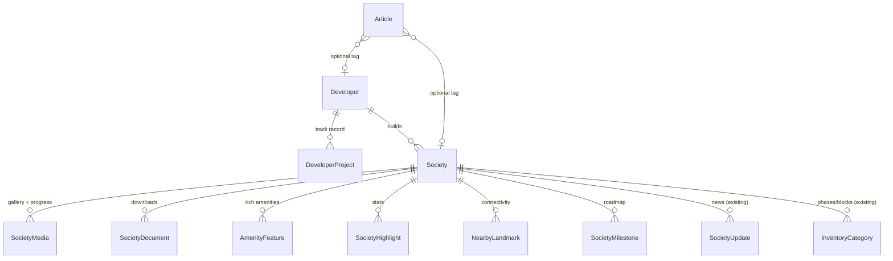

# Society Profile V2 — Foundations

Shared, cross-cutting rules for **every** module. This is the small companion to
attach in (almost) every build session alongside the specific module file(s).

- Index: [`../society-profile-v2-spec.md`](../society-profile-v2-spec.md)
- Build prompts: [`../../society-profile-v2-playbook.md`](../../society-profile-v2-playbook.md)
- Related: [ADR-007 (concierge pivot)](../ADR-007-concierge-pivot.md), [ADR-008 (society profile maps)](../ADR-008-society-profile-maps.md), [ADR-009 (media & document storage)](../ADR-009-media-document-storage.md)

---

## 1. Architecture overview

All new content hangs off `Society` (and a new top-level `Developer`). The composition root remains `packages/api-client`; pages never touch Prisma/domain directly.

### 1.1 Layering rules applied to every module

- **Types first** (`packages/types`): Zod schema + `as const` enums; TS types via `z.infer`. Mirror Prisma enums exactly (`.cursor/rules/oop-and-domain-modeling.mdc`).
- **Schema** (`packages/database`): `cuid()` ids, `@@index` on every FK, `Decimal` for money, enums for closed sets. One migration per logical change.
- **API** (`packages/api-client`): one router file per area; `publicProcedure` for reads consumed by the profile (always filtered to `publishStatus = PUBLISHED`); `opsProcedure` for society creation/lifecycle (M0); `societyAdminProcedure` + `assertSocietyOwnership` for portal writes; `superAdminProcedure` for `Developer`/`Article`, admin assignment, and bulk import (platform-curated). DTO mappers serialize `Date`/`Decimal` like `society-update.router.ts`.
- **UI** (`apps/web`): server components fetch via `getApi()`; client-only widgets (lightbox, video) dynamically imported with skeleton fallbacks to preserve ISR/SEO, mirroring `society-location-map-dynamic.tsx`.

---

## 2. Concierge & security alignment

Applies across all modules (`.cursor/rules/concierge-model.mdc`, `.cursor/rules/security.mdc`):

- **CTAs:** All new sections reuse the existing `QuoteRequestForm` / "Talk to an advisor" path. No "Book Now", no price-to-buy button, no buyer↔dealer contact.
- **Sales partners (optional display):** if surfaced, render authorized partners (`SocietyPartnerAuthorization` with `status=ACTIVE`) as logos/names only, **gated behind a new `FEATURE_SOCIETY_SALES_PARTNERS` flag** (default off, added to `apps/web/lib/feature-flags.ts` and `.env.example`). Never expose `commissionSplitPct`, `dealerNetPkr`, `spreadPkr`, or dealer contact.
- **Procedures:** public reads via `publicProcedure`; society creation/lifecycle via `opsProcedure`; society-owned content via `societyAdminProcedure` + `assertSocietyOwnership`; platform-curated content (`Developer`, `Article`), admin assignment, and bulk import via `superAdminProcedure`. Never trust IDs/roles from input (`ctx.session` only).
- **Uploads:** server-side content-type allow-list + size cap; signed, short-lived URLs; sensitive docs (LOP/NOC, `isPublic=false`) require auth before URL minting. No PII in object keys or filenames. See [`storage.md`](storage.md).
- **Access matrix:** add rows to `docs/architecture/access-rights-matrix.md` for every new mutation.

---

## 3. Data-model change summary (additive)

New models: `SocietyMedia`, `SocietyDocument`, `AmenityFeature`, `SocietyHighlight`, `NearbyLandmark`, `Developer`, `DeveloperProject`, `SocietyMilestone`, `Article`.
New enums: `SocietyPublishStatus` (M0), `SocietyMediaKind`, `SocietyDocumentKind`, `LandmarkCategory`, `MilestoneStatus`.
New `Society` fields: `publishStatus` (default `DRAFT`), `publishedAt?`, `createdById?` (M0); `virtualTourUrl?`, `promoVideoUrl?`, `developerId?` (+ relation).
New indexes (M0): `@@index` on `authority`, `verificationTier`, `publishStatus`, `[publishStatus, citySlug]`, and a `pg_trgm` trigram index on `name`.
New relations added to `Society` and `Developer`. **No columns dropped or renamed; existing `amenities String[]` and `heroImageUrl` retained.** Each module ships its own migration (one logical change per migration, per `database.mdc`).

> **Backfill:** the `publishStatus` default is `DRAFT`, but existing seeded societies must be backfilled to `PUBLISHED` in the M0 migration (or seed) so the current marketplace doesn't go dark. New societies created via `society.create` start as `DRAFT`.

---

## 4. Rollout & phasing

0. **M0 onboarding & scale foundation first** — lifecycle (`publishStatus`), `society.create`/publish/assign-admin, completeness gate, reference data, the paginated `listSummaries`/`facets` procedures, search indexes, and on-demand revalidation. Backfill existing societies to `PUBLISHED`. Everything else depends on this. See [`m0-onboarding-and-scale.md`](m0-onboarding-and-scale.md).
1. **Data + API + storage foundation** (types, schema/migrations, routers, storage adapter) — invisible to users.
2. **Admin onboarding console** so ops can start adding societies one-by-one immediately.
3. **Profile UI** module-by-module behind seeded data; ship as each lands.
4. **Portal/admin editors** so societies/admins can populate content (see [`portal-editors.md`](portal-editors.md)).
5. **Blog + developer pages + SEO/sitemap** last (see [`seo.md`](seo.md)).
6. **Flags:** `FEATURE_SOCIETY_SALES_PARTNERS` (default off). No other user-facing flag required since modules degrade gracefully on empty data.
7. **Seed:** extend `packages/database/prisma/seed.ts` with realistic media/doc/landmark/developer/milestone fixtures (Pakistani context) and at least one `DRAFT` society so the lifecycle is exercised in dev and E2E.

---

## 5. Acceptance (feature-complete definition)

- **Onboarding (M0):** ops/admin can create a society as `DRAFT`, populate it over time with a visible completeness %, and publish it once the gate passes; drafts/archived never leak into public reads, sitemap, or static params. Bulk import is idempotent with a per-row report. The directory list + facets are paginated and run in a bounded number of queries with index-backed search — verified to hold as the society count scales into the thousands.
- A seeded society profile renders: hero, gallery (with lightbox), highlights, rich amenities, connectivity, documents, developer credibility, milestone roadmap, progress photos, and (existing) updates/reviews/payment-plan/map — all with proper empty/loading/error states.
- Every CTA leads to a quote request; no booking or dealer-contact path is reachable.
- Society admins can edit all society-owned content from the portal; super-admins manage developers, articles, society lifecycle, and admin assignment.
- Create/publish/archive are audited via the standard ledger builder.
- `pnpm turbo run test lint typecheck` is clean; new procedures have tests; access-rights matrix updated.
