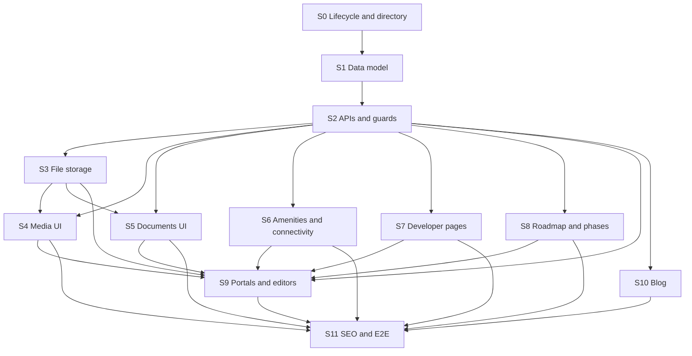

# Society Profile V2 — Session Report (Plain English)

Companion to [`society-profile-v2-playbook.md`](society-profile-v2-playbook.md). That file is the **how-to guide** for engineers running each build session. This report explains **what each session does** and **how important it is**, in simple words.

---

## What we are building (big picture)

We are upgrading Sectoria’s society profiles from basic listings to **Urban City–grade profile pages**: photos, galleries, documents, amenities, location connectivity, developer credibility, construction milestones, sub-community phases, and a blog.

Everything stays inside the **concierge model**:

- Buyers do **not** book or checkout on their own.
- Every main call-to-action leads to a **quote request** with an advisor.
- We never expose dealer pricing, commissions, or direct dealer contact.

We are also building the **onboarding pipeline** so the platform team can add societies across Pakistan one by one: create as draft → fill in content → publish when ready → show only published societies to the public.

**Golden rule:** Do not start the next session until the current session’s test gate passes. A mistake in an early session spreads to every later one.

---

## How to read importance

| Level | Meaning |
|---|---|
| **Critical** | The whole project breaks or becomes unsafe without this. Must be done first and done correctly. |
| **High** | Core product value or day-to-day operations depend on it. |
| **Medium** | Important for polish, trust, or growth, but the site can function in a limited way without it. |
| **Launch polish** | Needed for a confident public launch (search engines, automated tests), not for a rough internal demo. |

Sessions are numbered **S0–S11**. Lower numbers are foundations; higher numbers are what users see and how teams manage content.

---

## Session overview at a glance

| Session | In one line | Importance |
|---|---|---|
| **S0** | How societies are created, drafted, published, and listed at scale | **Critical** |
| **S1** | Database tables and types for all new profile content | **Critical** |
| **S2** | Secure APIs that read/write that content with correct permissions | **Critical** |
| **S3** | Safe file upload and download for photos and PDFs | **Critical** |
| **S4** | Hero image, photo gallery, progress photos, virtual tour | **High** |
| **S5** | Downloadable documents (brochures, plans, NOC, etc.) | **High** |
| **S6** | Amenities, highlights, and nearby landmarks | **High** |
| **S7** | Developer profile pages and track record | **High** |
| **S8** | Construction roadmap and phase/sub-community sections | **Medium** |
| **S9** | Admin and society portals to edit all of the above | **High** |
| **S10** | Blog and content hub | **Medium** |
| **S11** | SEO, sitemap, structured data, and end-to-end tests | **Launch polish** |

---

## The foundation block (S0–S3)

These four sessions are the **load-bearing walls**. Skip or rush them and every UI session above will be shaky, slow, or insecure.

### S0 — Society lifecycle, onboarding console & directory scale

**What we are doing**

- Adding a proper **life cycle** for every society: Draft → Published → Archived.
- Letting **platform ops** (not buyers) create new societies, assign admins, and publish when a society is complete enough.
- Building an **admin console** to search, filter, and manage societies with a completeness score.
- Fixing **directory performance** so listing hundreds or thousands of societies does not slow down the site (no “one query per society” problems).
- Supporting **bulk import** so many societies can be loaded safely, always starting as drafts.
- Making sure **only published societies** appear on the public marketplace, sitemap, and search.

**Why it matters**

Today there is no governed way to onboard a society. The public directory also has scalability issues. Without S0, you cannot reliably add societies across Pakistan, drafts might leak to buyers, and the directory will not scale.

**Importance: Critical** — This is session zero for a reason. Sessions S1–S11 all assume S0 exists.

---

### S1 — Types, database schema, and migrations

**What we are doing**

- Defining the **data shapes** (TypeScript + Zod) for media, documents, amenities, landmarks, developers, milestones, and blog articles.
- Adding the matching **database tables and columns** in Postgres via Prisma migrations.
- Seeding **realistic Pakistani example data** so developers can see a full profile locally.

**Why it matters**

This session is **structure only** — no screens, no API yet. But nothing else can be built without knowing where photos, PDFs, amenities, and milestones live in the database. Bad schema here means painful fixes later.

**Importance: Critical** — The blueprint for all profile content. S2 and S3 plug into what S1 defines.

---

### S2 — API routers and security guards

**What we are doing**

- Building the **backend endpoints** (tRPC) to list and manage media, documents, amenities, landmarks, developers, milestones, and articles.
- Enforcing **who can do what**: public can read published content; society admins can edit their own society; super admins manage developers and blog posts.
- Hiding **private documents** and **dealer-sensitive fields** from public responses.
- Documenting every new permission in the access-rights matrix.

**Why it matters**

The UI does not talk to the database directly. If APIs are wrong, you get data leaks, cross-society edits, or buyer-facing responses that break the concierge rules.

**Importance: Critical** — Security and correctness layer between data and users.

---

### S3 — Storage adapter and presigned uploads

**What we are doing**

- Choosing and implementing **where files live** (cloud object storage in production, local/mock in dev and CI).
- Letting authorized users **upload** photos and PDFs via short-lived signed URLs — not wide-open uploads.
- Serving **public media** from CDN-friendly URLs and **private docs** (e.g. LOP/NOC) only after auth checks, with expiring download links.
- Recording the decision in **ADR-009** and tightening **Content Security Policy** for images, uploads, and virtual-tour embeds.

**Why it matters**

Profiles need real files. Without controlled storage, you either cannot upload anything, or you risk serving sensitive documents to anyone with a link.

**Importance: Critical** — Required before portals (S9) can upload content and before document UI (S5) works for real files.

---

## What buyers see on the profile (S4–S8)

These sessions turn the foundation into a **rich, trustworthy profile page**. They are mostly UI work following patterns from the design system.

### S4 — Media, galleries, and virtual tour

**What we are doing**

- **Hero image** with verification badge.
- **Photo gallery** with an accessible lightbox (keyboard, screen reader, no layout jump).
- **Progress gallery** showing construction photos over time.
- **Virtual tour and promo video** that load only when the user clicks (better performance and privacy).

**Why it matters**

Photos and tours are the first thing a buyer trusts. A weak hero or broken gallery makes the whole society feel unfinished.

**Importance: High** — Primary visual trust signal on every society page.

---

### S5 — Documents and downloads

**What we are doing**

- Download cards for **master plan, brochure, payment plan, LOP, NOC**, grouped and labeled clearly.
- Public profile shows **only public documents**; private compliance docs stay gated.
- Safe links: signed URLs, no personal data in filenames shown to users.

**Why it matters**

Buyers and advisors need official PDFs to evaluate a society. This is compliance and trust, not decoration.

**Importance: High** — Especially for regulated / verified societies.

---

### S6 — Amenities, highlights, and connectivity

**What we are doing**

- **Rich amenity cards** (pool, mosque, park, etc.) with icons and descriptions; falls back to simple tags if rich data is missing.
- **Highlight stats** near the top (e.g. total area, units, delivery timeline).
- **Nearby landmarks** with drive times, shown next to the existing map — admin-entered only, no paid Google Places API.

**Why it matters**

Helps buyers answer “what’s here?” and “how do I get around?” without calling a dealer.

**Importance: High** — Core comparison content on the profile.

---

### S7 — Developer profiles and track record

**What we are doing**

- A **developer block** on the society profile (logo, name, link).
- Standalone **developer pages** with bio, past projects, and societies they built on Sectoria.
- SEO-friendly structured data; **no** pricing or “contact developer to buy” paths — still concierge-only.

**Why it matters**

In Pakistan, buyer trust often follows the **builder’s reputation**, not just the society name.

**Importance: High** — Differentiator vs. generic listing sites; supports premium societies.

---

### S8 — Milestone roadmap and phase sections

**What we are doing**

- **Construction roadmap**: planned, in-progress, and completed milestones on a timeline.
- **Phase / sub-community sections**: group inventory by phase with blocks, categories, starting prices, and availability; keep the flat grid as a fallback.

**Why it matters**

Buyers want to know **when things will be ready** and **which block or phase** they are looking at. This reduces advisor back-and-forth.

**Importance: Medium** — Strong for under-construction societies; less critical for fully built ones.

---

## How teams manage content (S9–S10)

### S9 — Society portal and admin editors

**What we are doing**

- **Society portal**: society admins upload media, manage documents (public/private), edit amenities, landmarks, milestones, and basic profile fields — **only for their society**.
- **Admin portal**: super admins manage **developers**, **developer projects**, and (with S10) **articles**.
- Uploads use the presigned flow from S3; destructive actions need confirmation.

**Why it matters**

Without editors, all rich profile content would be engineer-only or seed data. This is how the product **scales operationally** after launch.

**Importance: High** — Without S9, profiles cannot be maintained by society teams day to day.

---

### S10 — Blog and content hub

**What we are doing**

- Public **blog index and article pages** with sanitized markdown (no unsafe HTML).
- Optional **“Related reading”** on society and developer profiles.
- SEO metadata and article structured data; unpublished posts stay hidden.

**Why it matters**

Supports **education, SEO, and marketing** — market updates, society deep dives, developer stories. Not required for a minimal profile to work.

**Importance: Medium** — Valuable for growth and authority; can ship shortly after core profiles if needed.

---

## Launch confidence (S11)

### S11 — SEO, sitemap, JSON-LD, and E2E tests

**What we are doing**

- Rich **structured data** for images, videos, developers, and articles so Google understands the pages.
- **Sitemap** updates: developers, blog posts, only **published** societies.
- Correct **social preview images** (Open Graph) per page type.
- **Playwright end-to-end tests**: hero, gallery, document, landmark, developer block, milestone visible; every main CTA goes to quote request; **no** book-now or dealer-contact paths.

**Why it matters**

This session does not add new buyer features — it proves the enriched profile **works as one system** and is **discoverable and safe to launch**. Catches regressions before production.

**Importance: Launch polish** — Required before treating V2 as production-ready; not blocking an internal demo of S4–S8.

---

## Suggested order and dependencies

**Strict sequence:** S0 → S1 → S2 → S3 (never skip or reorder).

**UI sessions S4–S8** can overlap in planning but should follow S2/S3 in execution; S9 needs the UI patterns and storage from earlier sessions.

**S10** can run in parallel with late UI work once article APIs exist (from S2).

**S11** runs last, when the full profile path exists.

---

## Bottom line for stakeholders

| If you care about… | Focus on these sessions |
|---|---|
| **Can we onboard societies safely at national scale?** | S0 (non-negotiable) |
| **Will the site stay secure and compliant?** | S0, S2, S3, S5, S9 |
| **Will buyers trust what they see?** | S4, S5, S6, S7 |
| **Can society teams update their own pages?** | S9 (depends on S0–S3) |
| **Will Google and social previews work?** | S7, S10, S11 |
| **Are we ready to ship without surprises?** | S11 |

**Rough effort split:** about one third of the work is **foundation** (S0–S3), about half is **profile experience and editing** (S4–S9), and the remainder is **content marketing and launch quality** (S10–S11).

For step-by-step prompts, file attachments, and test checklists, use [`society-profile-v2-playbook.md`](society-profile-v2-playbook.md).
